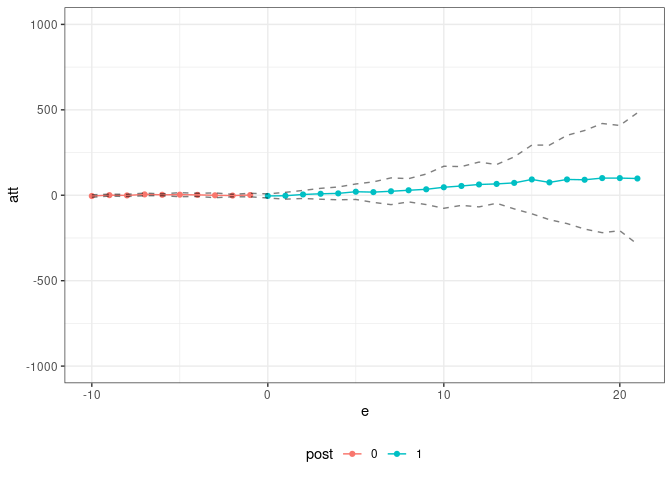

<!-- README.md is generated from README.Rmd. Please edit that file -->

# Pandemic Policy Evaluation (ppe) package

The `ppe` package contains code for estimating policy effects during the
pandemic. It is the companion code for [Callaway and Li (2021). Policy
Evaluation during a Pandemic](https://arxiv.org/abs/2105.06927). The
central idea of that paper is to compare locations who implemented some
policy to other locations that did not implement the policy *and that
had the same pre-treatment values of Covid-19 related characteristics*.
These characteristics definitely include (i) the current number of cases
and (ii) the number of susceptible individuals (or equivalently the
cumulative number of cases). They might also include demographic
characteristics, population densities, region of the country, among
others.

This amounts to an unconfoundedness-type strategy. In the paper, we
compare it to a difference in differences strategy and argue that the
unconfoundedness strategy is likely to be more appropriate to evaluate
policies during the pandemic. The rationale for this argument is that
epidemic models from the epidemiology literature are highly nonlinear
but do not involve individual-level unobserved heterogeneity. See our
[five minute
summary](https://bcallaway11.github.io/posts/five-minute-pandemic-policy)
for additional discussion along these lines.

In practice, we use a doubly robust estimation procedure that estimates
both the propensity score (which is related to the treatment assigment
model) and an outcome regression for untreated potential outcomes (which
is related to the epidemic model). An important advantage of this is
that, at least to some extent, it allows us to side-step the issue of
estimating a full epidemic model.

To demonstrate our approach, we provide a shortened version of the
application from our paper which is about the effect of shelter-in-place
orders early in the pandemic. We have state-level data about Covid-19
cases, tests, and the timing when a state adopted a shelter-in-place
order.

``` r
# load the data
data(covid_data)

# formula for covariates
xformla <- ~ current + current^2 + current^3 + region + totalTestResults
```

A first issue is that there are major overlap violations — for example,
there are just not good comparison states for New York. As a first step,
we drop those:

``` r
trim_id_list <- lapply(c(10,15,20,25,30),
                       did::trimmer,
                       tname="time.period",
                       idname="state_id",
                       gname="group",
                       xformla=xformla,
                       data=covid_data,
                       control_group="nevertreated",
                       threshold=0.95)
#> Warning: glm.fit: algorithm did not converge
#> Warning: glm.fit: fitted probabilities numerically 0 or 1 occurred
#> [1] "hard to match treated observations: "
#> # A tibble: 4 x 1
#>   state_id
#>      <int>
#> 1        5
#> 2       15
#> 3       32
#> 4       35
#> [1] "hard to match treated observations: "
#> # A tibble: 5 x 1
#>   state_id
#>      <int>
#> 1        7
#> 2       19
#> 3       23
#> 4       47
#> 5       48
#> [1] "hard to match treated observations: "
#> # A tibble: 3 x 1
#>   state_id
#>      <int>
#> 1       31
#> 2       39
#> 3       40
#> Warning: glm.fit: algorithm did not converge

#> Warning: glm.fit: fitted probabilities numerically 0 or 1 occurred
#> [1] "hard to match treated observations: "
#> # A tibble: 7 x 1
#>   state_id
#>      <int>
#> 1        2
#> 2       10
#> 3       11
#> 4       22
#> 5       25
#> 6       26
#> 7       44
#> Warning: glm.fit: fitted probabilities numerically 0 or 1 occurred
#> [1] "hard to match treated observations: "
#> # A tibble: 1 x 1
#>   state_id
#>      <int>
#> 1       41
time_id_list <- unlist(trim_id_list)

# states that we will drop
unique(subset(covid_data, state_id %in% time_id_list)$state)
#>  [1] "AL" "CA" "CT" "FL" "GA" "IL" "LA" "ME" "MI" "MO" "MS" "NH" "NJ" "NY" "PA"
#> [16] "RI" "SC" "TX" "VT" "WA"
covid_data2 <- subset(covid_data, !(state_id %in% time_id_list))
```

Next, we use the [`pte`](https://github.com/bcallaway11/pte) package to
estimate policy effects. This basically involves us only having to write
a new function to compute group-time average treatment effects — for us,
it is the function
[`covid_attgt`](https://github.com/bcallaway11/ppe/blob/master/R/covid_attgt.R)
(which is essentially just a function to compute doubly robust treatment
effect estimates under unconfoundedness and that include lags of some
variables).

``` r
res <- pte(yname="positive",
           gname="group",
           tname="time.period",
           idname="state_id",
           data=covid_data2,
           subset_fun=two_by_two_subset,
           attgt_fun=covid_attgt,
           xformla=xformla,
           max_e=21,
           min_e=-10) 

summary(res)
#> 
#> Overall ATT:  
#>      ATT    Std. Error     [ 95%  Conf. Int.] 
#>  74.0998       59.4855   -42.4897    190.6894 
#> 
#> 
#> Dynamic Effects:
#>  Event Time Estimate Std. Error     [95%  Conf. Band] 
#>         -10  -4.4309     2.4017  -11.6861      2.8243 
#>          -9   0.6468     1.8405   -4.9131      6.2067 
#>          -8  -1.0199     2.1286   -7.4501      5.4104 
#>          -7   4.9369     2.5523   -2.7734     12.6471 
#>          -6   2.7974     1.7711   -2.5529      8.1477 
#>          -5   3.3207     3.9245   -8.5348     15.1763 
#>          -4   2.2912     3.0416   -6.8972     11.4796 
#>          -3  -0.3394     4.6458  -14.3739     13.6951 
#>          -2  -1.8006     2.4285   -9.1367      5.5355 
#>          -1   1.2608     3.4020   -9.0163     11.5379 
#>           0  -4.0483     4.0061  -16.1501      8.0536 
#>           1  -2.8472     6.6204  -22.8467     17.1523 
#>           2   4.6124     7.7796  -18.8887     28.1136 
#>           3   8.6060    10.5651  -23.3101     40.5220 
#>           4  10.9207    12.3837  -26.4889     48.3304 
#>           5  20.6761    14.9968  -24.6273     65.9796 
#>           6  18.3053    19.8875  -41.7726     78.3833 
#>           7  23.3457    25.9165  -54.9449    101.6363 
#>           8  29.1808    22.5133  -38.8293     97.1908 
#>           9  34.8426    29.6036  -54.5864    124.2716 
#>          10  46.7525    40.7380  -76.3123    169.8173 
#>          11  54.3023    37.5861  -59.2411    167.8456 
#>          12  63.0487    43.4107  -68.0900    194.1875 
#>          13  66.3826    37.5309  -46.9940    179.7591 
#>          14  72.4041    50.4022  -79.8553    224.6635 
#>          15  92.5038    66.5203 -108.4465    293.4541 
#>          16  75.2222    72.2217 -142.9510    293.3955 
#>          17  92.4658    85.4772 -165.7510    350.6827 
#>          18  90.5871    95.4655 -197.8032    378.9774 
#>          19 100.4617   105.7537 -219.0080    419.9313 
#>          20 100.4475   101.9744 -207.6054    408.5004 
#>          21  98.0003   127.3226 -286.6266    482.6272 
#> ---
#> Signif. codes: `*' confidence band does not cover 0
```

and we can also plot the results in event study.

``` r
plot_df <- summary(res)$event_study
colnames(plot_df) <- c("e", "att", "se", "cil", "ciu")
plot_df$post <- as.factor(1*(plot_df$e >= 0))
ggplot(plot_df, aes(x=e, y=att)) +
  geom_line(aes(color=post)) +
  geom_point(aes(color=post)) + 
  geom_line(aes(y=ciu), linetype="dashed", alpha=0.5) +
  geom_line(aes(y=cil), linetype="dashed", alpha=0.5) +
  ylim(c(-1000,1000)) +
  theme_bw() +
  theme(legend.position="bottom")
```

<!-- -->
