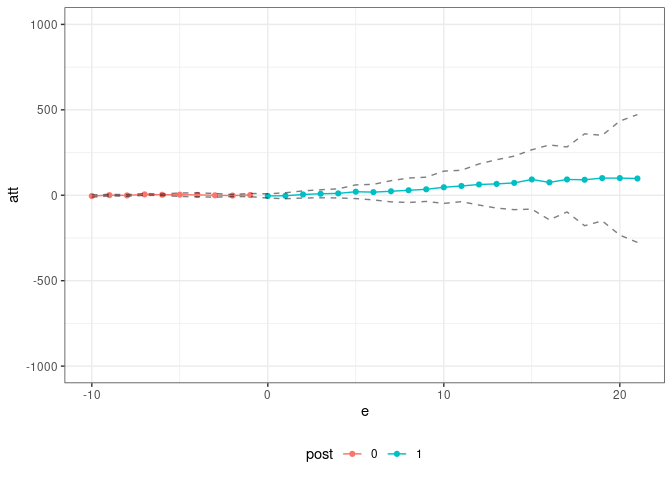
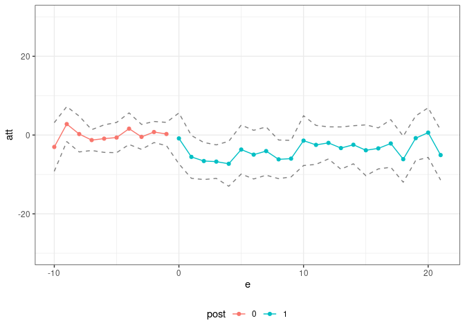

<!-- README.md is generated from README.Rmd. Please edit that file -->

# Pandemic Policy Evaluation (ppe) package

The `ppe` package contains code for estimating policy effects during the
pandemic. It is the companion code for [Callaway and Li (2021). Policy
Evaluation during a Pandemic](https://arxiv.org/abs/2105.06927). The
central idea of that paper is to compare locations who implemented some
policy to other locations that did not implement the policy *and that
had the same pre-treatment values of Covid-19 related characteristics*.
These characteristics definitely include (i) the current number of cases
and (ii) the number of susceptible individuals (or equivalently the
cumulative number of cases). They might also include demographic
characteristics, population densities, region of the country, among
others.

This amounts to an unconfoundedness-type strategy. In the paper, we
compare it to a difference in differences strategy and argue that the
unconfoundedness strategy is likely to be more appropriate to evaluate
policies during the pandemic. The rationale for this argument is that
epidemic models from the epidemiology literature are highly nonlinear
but do not involve individual-level unobserved heterogeneity. See our
[five minute
summary](https://bcallaway11.github.io/posts/five-minute-pandemic-policy)
for additional discussion along these lines.

In practice, we use a doubly robust estimation procedure that estimates
both the propensity score (which is related to the treatment assigment
model) and an outcome regression for untreated potential outcomes (which
is related to the epidemic model). An important advantage of this is
that, at least to some extent, it allows us to side-step the issue of
estimating a full epidemic model.

To demonstrate our approach, we provide a shortened version of the
application from our paper which is about the effect of shelter-in-place
orders early in the pandemic. We have state-level data about Covid-19
cases, tests, and the timing when a state adopted a shelter-in-place
order.

``` r
# load the data
data(covid_data)

# formula for covariates
xformla <- ~ current + I(current^2) + region + totalTestResults
```

A first issue is that there are major overlap violations — for example,
there are just not good comparison states for New York. As a first step,
we drop those:

``` r
trim_id_list <- lapply(c(10,15,20,25,30),
                       did::trimmer,
                       tname="time.period",
                       idname="state_id",
                       gname="group",
                       xformla=xformla,
                       data=covid_data,
                       control_group="nevertreated",
                       threshold=0.95)
time_id_list <- unlist(trim_id_list)
```

``` r
# states that we will drop
unique(subset(covid_data, state_id %in% time_id_list)$state)
#>  [1] "AL" "CA" "CO" "CT" "FL" "GA" "IL" "LA" "ME" "MI" "MO" "MS" "NH" "NJ" "NY"
#> [16] "PA" "RI" "SC" "TX" "VT" "WA"
covid_data2 <- subset(covid_data, !(state_id %in% time_id_list))
```

Next, we use the [`pte`](https://github.com/bcallaway11/pte) package to
estimate policy effects. This basically involves us only having to write
a new function to compute group-time average treatment effects — for us,
it is the function
[`covid_attgt`](https://github.com/bcallaway11/ppe/blob/master/R/covid_attgt.R)
(which is essentially just a function to compute doubly robust treatment
effect estimates under unconfoundedness and that include lags of some
variables).

``` r
res <- pte(yname="positive",
           gname="group",
           tname="time.period",
           idname="state_id",
           data=covid_data2,
           subset_fun=two_by_two_subset,
           attgt_fun=covid_attgt,
           xformla=xformla,
           max_e=21,
           min_e=-10) 

summary(res)
#> 
#> Overall ATT:  
#>      ATT    Std. Error     [ 95%  Conf. Int.] 
#>  14.8882       62.3559  -107.3272    137.1035 
#> 
#> 
#> Dynamic Effects:
#>  Event Time Estimate Std. Error     [95%  Conf. Band] 
#>         -10  -3.7266     4.1438  -15.6623      8.2090 
#>          -9   2.6607     1.6598   -2.1202      7.4416 
#>          -8   0.8290     1.8678   -4.5510      6.2089 
#>          -7   5.2843     2.2360   -1.1562     11.7249 
#>          -6   2.8555     2.2317   -3.5726      9.2836 
#>          -5   1.3589     3.0987   -7.5663     10.2841 
#>          -4   0.3294     4.4509  -12.4908     13.1495 
#>          -3  -4.2227     4.9524  -18.4873     10.0420 
#>          -2  -3.8447     2.7785  -11.8477      4.1582 
#>          -1  -0.2234     3.4595  -10.1879      9.7411 
#>           0 -10.8156     9.3003  -37.6037     15.9724 
#>           1 -13.7998    14.9859  -56.9641     29.3645 
#>           2  -7.8432    12.9193  -45.0550     29.3686 
#>           3  -4.5541     8.0687  -27.7947     18.6864 
#>           4  -3.5368    11.9346  -37.9125     30.8389 
#>           5   8.5221    11.6450  -25.0194     42.0636 
#>           6   1.1140    17.3483  -48.8549     51.0829 
#>           7   6.6384    21.7908  -56.1264     69.4033 
#>           8   7.1288    22.8506  -58.6886     72.9462 
#>           9  10.8758    34.4597  -88.3798    110.1314 
#>          10  17.5057    34.6000  -82.1537    117.1651 
#>          11  40.8318    46.6711  -93.5965    175.2601 
#>          12  48.6134    52.8799 -103.6984    200.9251 
#>          13  52.4228    61.2122 -123.8889    228.7345 
#>          14  50.2000    50.5074  -95.2782    195.6783 
#>          15  68.2960    85.2968 -177.3873    313.9793 
#>          16  44.7305    71.6228 -161.5671    251.0281 
#>          17  61.4670    84.4064 -181.6516    304.5855 
#>          18  50.4635   114.2564 -278.6330    379.5600 
#>          19  47.3392   127.5906 -320.1643    414.8427 
#>          20  28.6326   107.1552 -280.0101    337.2754 
#>          21   4.3445   180.4437 -515.3937    524.0827 
#> ---
#> Signif. codes: `*' confidence band does not cover 0
```

and we can also plot the results in event study.

``` r
ggpte(res) + ylim(c(-1000,1000))
```

<!-- -->

To conclude, we provide estimate effects of the effects of
shelter-in-place orders on travel. In the paper, we mainly consider the
case where (i) the policy can have a direct effect on travel, (ii) the
policy can have a direct effect on Covid-19 cases, and (iii) Covid-19
cases can have their own effect on travel. This means that the policy
can have an indirect effect on travel through its effect on Covid-19
cases. We show in the paper that neither standard DID (ignoring cases)
nor DID that includes current cases as a covariate delivers a suitable
estimate of the effect of the policy on travel in this case. We propose
an alternative estimator that accounts for the indirect effect of the
policy on travel through its effect on cases, and show code for this
approach below.

``` r
oo_res <- pte(yname="retail_and_recreation_percent_change_from_baseline",
           gname="group",
           tname="time.period",
           idname="state_id",
           data=covid_data2,
           subset_fun=two_by_two_subset,
           attgt_fun=other_outcome_attgt,
           xformla=xformla,
           max_e=21,
           min_e=-10,
           Iname="current",
           adjustI=TRUE) 
#> Warning in compute.aggte(MP = MP, type = type, balance_e = balance_e, min_e
#> = min_e, : Simultaneous conf. band is somehow smaller than pointwise one
#> using normal approximation. Since this is unusual, we are reporting pointwise
#> confidence intervals

summary(oo_res)
#> 
#> Overall ATT:  
#>      ATT    Std. Error     [ 95%  Conf. Int.]  
#>  -3.9162        1.8308    -7.5045      -0.328 *
#> 
#> 
#> Dynamic Effects:
#>  Event Time Estimate Std. Error    [95%  Conf. Band]  
#>         -10  -3.0210     2.4636 -10.5547      4.5127  
#>          -9   2.7846     1.7463  -2.5557      8.1249  
#>          -8   0.2543     1.4148  -4.0722      4.5809  
#>          -7  -1.2765     1.0040  -4.3467      1.7937  
#>          -6  -0.9085     1.0752  -4.1965      2.3795  
#>          -5  -0.6359     1.4659  -5.1186      3.8468  
#>          -4   1.6184     1.0121  -1.4767      4.7135  
#>          -3  -0.4660     1.1486  -3.9784      3.0465  
#>          -2   0.7693     1.0473  -2.4333      3.9720  
#>          -1   0.2643     1.2045  -3.4190      3.9476  
#>           0  -0.8510     2.4843  -8.4483      6.7462  
#>           1  -5.5461     1.8891 -11.3230      0.2308  
#>           2  -6.5928     1.6249 -11.5617     -1.6239 *
#>           3  -6.7447     1.9919 -12.8360     -0.6535 *
#>           4  -7.2925     1.8490 -12.9467     -1.6383 *
#>           5  -3.6784     2.8741 -12.4675      5.1107  
#>           6  -4.9731     2.0622 -11.2794      1.3332  
#>           7  -4.0683     2.2348 -10.9023      2.7657  
#>           8  -6.1649     1.4898 -10.7208     -1.6090 *
#>           9  -5.9830     1.9711 -12.0108      0.0448  
#>          10  -1.4185     2.2347  -8.2524      5.4154  
#>          11  -2.4974     2.1715  -9.1379      4.1431  
#>          12  -1.9884     1.5368  -6.6880      2.7111  
#>          13  -3.3056     2.1864  -9.9917      3.3806  
#>          14  -2.4633     1.8998  -8.2730      3.3464  
#>          15  -3.8627     1.9105  -9.7050      1.9797  
#>          16  -3.3849     1.8051  -8.9050      2.1352  
#>          17  -2.1404     2.1371  -8.6758      4.3950  
#>          18  -6.1309     1.7045 -11.3434     -0.9184 *
#>          19  -0.7883     2.3134  -7.8628      6.2862  
#>          20   0.6190     2.9215  -8.3151      9.5532  
#>          21  -5.0789     3.1757 -14.7903      4.6324  
#> ---
#> Signif. codes: `*' confidence band does not cover 0

# make an event study plot
ggpte(oo_res) + ylim(c(-30,30))
```

<!-- -->
