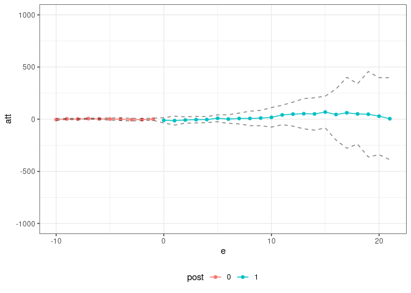

<!-- README.md is generated from README.Rmd. Please edit that file -->

# Pandemic Policy Evaluation (ppe) package

The `ppe` package contains code for estimating policy effects during the
pandemic. It is the companion code for [Callaway and Li (2021). Policy
Evaluation during a Pandemic](https://arxiv.org/abs/2105.06927). The
central idea of that paper is to compare locations who implemented some
policy to other locations that did not implement the policy *and that
had the same pre-treatment values of Covid-19 related characteristics*.
These characteristics definitely include (i) the current number of cases
and (ii) the number of susceptible individuals (or equivalently the
cumulative number of cases). They might also include demographic
characteristics, population densities, region of the country, among
others.

This amounts to an unconfoundedness-type strategy. In the paper, we
compare it to a difference in differences strategy and argue that the
unconfoundedness strategy is likely to be more appropriate to evaluate
policies during the pandemic. The rationale for this argument is that
epidemic models from the epidemiology literature are highly nonlinear
but do not involve individual-level unobserved heterogeneity. See our
[five minute
summary](https://bcallaway11.github.io/posts/five-minute-pandemic-policy)
for additional discussion along these lines.

In practice, we use a doubly robust estimation procedure that estimates
both the propensity score (which is related to the treatment assigment
model) and an outcome regression for untreated potential outcomes (which
is related to the epidemic model). An important advantage of this is
that, at least to some extent, it allows us to side-step the issue of
estimating a full epidemic model.

To demonstrate our approach, we provide a shortened version of the
application from our paper which is about the effect of shelter-in-place
orders early in the pandemic. We have state-level data about Covid-19
cases, tests, and the timing when a state adopted a shelter-in-place
order.

``` r
# load the data
data(covid_data)

# formula for covariates
xformla <- ~ current + I(current^2) + I(current^2) + region + totalTestResults
```

A first issue is that there are major overlap violations — for example,
there are just not good comparison states for New York. As a first step,
we drop those:

``` r
trim_id_list <- lapply(c(10,15,20,25,30),
                       did::trimmer,
                       tname="time.period",
                       idname="state_id",
                       gname="group",
                       xformla=xformla,
                       data=covid_data,
                       control_group="nevertreated",
                       threshold=0.95)
time_id_list <- unlist(trim_id_list)
```

``` r
# states that we will drop
unique(subset(covid_data, state_id %in% time_id_list)$state)
#>  [1] "AL" "CA" "CO" "CT" "FL" "GA" "IL" "LA" "ME" "MI" "MO" "MS" "NH" "NJ" "NY"
#> [16] "PA" "RI" "SC" "TX" "VT" "WA"
covid_data2 <- subset(covid_data, !(state_id %in% time_id_list))
```

Next, we use the [`pte`](https://github.com/bcallaway11/pte) package to
estimate policy effects. This basically involves us only having to write
a new function to compute group-time average treatment effects — for us,
it is the function
[`covid_attgt`](https://github.com/bcallaway11/ppe/blob/master/R/covid_attgt.R)
(which is essentially just a function to compute doubly robust treatment
effect estimates under unconfoundedness and that include lags of some
variables).

``` r
res <- pte(yname="positive",
           gname="group",
           tname="time.period",
           idname="state_id",
           data=covid_data2,
           subset_fun=two_by_two_subset,
           attgt_fun=covid_attgt,
           xformla=xformla,
           max_e=21,
           min_e=-10) 
#> Warning in compute.aggte(MP = MP, type = type, balance_e = balance_e, min_e
#> = min_e, : Simultaneous conf. band is somehow smaller than pointwise one
#> using normal approximation. Since this is unusual, we are reporting pointwise
#> confidence intervals

summary(res)
#> 
#> Overall ATT:  
#>      ATT    Std. Error     [ 95%  Conf. Int.] 
#>  14.8882       86.0828   -153.831    183.6073 
#> 
#> 
#> Dynamic Effects:
#>  Event Time Estimate Std. Error     [95%  Conf. Band] 
#>         -10  -3.7266     2.9289  -11.4070      3.9538 
#>          -9   2.6607     1.3462   -0.8695      6.1908 
#>          -8   0.8290     2.5387   -5.8282      7.4862 
#>          -7   5.2843     2.2773   -0.6875     11.2562 
#>          -6   2.8555     1.9364   -2.2223      7.9333 
#>          -5   1.3589     3.2004   -7.0335      9.7513 
#>          -4   0.3294     3.9728  -10.0886     10.7474 
#>          -3  -4.2227     5.2829  -18.0761      9.6308 
#>          -2  -3.8447     3.1225  -12.0329      4.3434 
#>          -1  -0.2234     4.4179  -11.8086     11.3618 
#>           0 -10.8156     9.1593  -34.8342     13.2030 
#>           1 -13.7998    13.9220  -50.3077     22.7081 
#>           2  -7.8432    12.8283  -41.4829     25.7966 
#>           3  -4.5541    10.0441  -30.8929     21.7846 
#>           4  -3.5368    14.2173  -40.8191     33.7455 
#>           5   8.5221    12.0524  -23.0831     40.1273 
#>           6   1.1140    13.4986  -34.2837     36.5117 
#>           7   6.6384    21.3796  -49.4256     62.7025 
#>           8   7.1288    28.4291  -67.4212     81.6788 
#>           9  10.8758    28.1486  -62.9388     84.6904 
#>          10  17.5057    37.5738  -81.0247    116.0361 
#>          11  40.8318    35.2361  -51.5682    133.2318 
#>          12  48.6134    44.5775  -68.2829    165.5097 
#>          13  52.4228    47.5653  -72.3083    177.1539 
#>          14  50.2000    59.9100 -106.9028    207.3029 
#>          15  68.2960    81.0562 -144.2589    280.8509 
#>          16  44.7305    73.1070 -146.9789    236.4400 
#>          17  61.4670   105.0498 -214.0066    336.9405 
#>          18  50.4635    99.0482 -209.2721    310.1991 
#>          19  47.3392   110.2171 -241.6846    336.3630 
#>          20  28.6326   125.3489 -300.0715    357.3368 
#>          21   4.3445   150.2227 -389.5866    398.2757 
#> ---
#> Signif. codes: `*' confidence band does not cover 0
```

and we can also plot the results in event study.

``` r
plot_df <- summary(res)$event_study
colnames(plot_df) <- c("e", "att", "se", "cil", "ciu")
plot_df$post <- as.factor(1*(plot_df$e >= 0))
ggplot(plot_df, aes(x=e, y=att)) +
  geom_line(aes(color=post)) +
  geom_point(aes(color=post)) + 
  geom_line(aes(y=ciu), linetype="dashed", alpha=0.5) +
  geom_line(aes(y=cil), linetype="dashed", alpha=0.5) +
  ylim(c(-1000,1000)) +
  theme_bw() +
  theme(legend.position="bottom")
```

<!-- -->

To conclude, we provide estimate effects of the effects of
shelter-in-place orders on travel. In the paper, we mainly consider the
case where (i) the policy can have a direct effect on travel, (ii) the
policy can have a direct effect on Covid-19 cases, and (iii) Covid-19
cases can have their own effect on travel. This means that the policy
can have an indirect effect on travel through its effect on Covid-19
cases. We show in the paper that neither standard DID (ignoring cases)
nor DID that includes current cases as a covariate delivers a suitable
estimate of the effect of the policy on travel in this case. We propose
an alternative estimator that accounts for the indirect effect of the
policy on travel through its effect on cases, and show code for this
approach below.

``` r
oo_res <- pte(yname="retail_and_recreation_percent_change_from_baseline",
           gname="group",
           tname="time.period",
           idname="state_id",
           data=covid_data2,
           subset_fun=two_by_two_subset,
           attgt_fun=other_outcome_attgt,
           xformla=xformla,
           max_e=21,
           min_e=-10,
           Iname="current",
           adjustI=TRUE) 
#> Warning in compute.aggte(MP = MP, type = type, balance_e = balance_e, min_e
#> = min_e, : Simultaneous conf. band is somehow smaller than pointwise one
#> using normal approximation. Since this is unusual, we are reporting pointwise
#> confidence intervals

summary(oo_res)
#> 
#> Overall ATT:  
#>      ATT    Std. Error     [ 95%  Conf. Int.]  
#>  -3.9162        1.8012    -7.4465      -0.386 *
#> 
#> 
#> Dynamic Effects:
#>  Event Time Estimate Std. Error    [95%  Conf. Band]  
#>         -10  -3.0210     2.0846  -8.9812      2.9392  
#>          -9   2.7846     1.8086  -2.3864      7.9556  
#>          -8   0.2543     1.4356  -3.8504      4.3591  
#>          -7  -1.2765     0.9758  -4.0664      1.5134  
#>          -6  -0.9085     1.1768  -4.2731      2.4561  
#>          -5  -0.6359     1.3622  -4.5308      3.2590  
#>          -4   1.6184     1.1133  -1.5647      4.8015  
#>          -3  -0.4660     1.4044  -4.4814      3.5495  
#>          -2   0.7693     0.9750  -2.0184      3.5570  
#>          -1   0.2643     1.1889  -3.1349      3.6634  
#>           0  -0.8510     2.3675  -7.6203      5.9183  
#>           1  -5.5461     1.7441 -10.5327     -0.5594 *
#>           2  -6.5928     1.3015 -10.3141     -2.8716 *
#>           3  -6.7447     1.6821 -11.5542     -1.9353 *
#>           4  -7.2925     2.2079 -13.6054     -0.9797 *
#>           5  -3.6784     2.2681 -10.1635      2.8067  
#>           6  -4.9731     1.7613 -10.0089      0.0628  
#>           7  -4.0683     2.2063 -10.3766      2.2400  
#>           8  -6.1649     1.6514 -10.8865     -1.4433 *
#>           9  -5.9830     1.7589 -11.0121     -0.9539 *
#>          10  -1.4185     2.6147  -8.8945      6.0574  
#>          11  -2.4974     1.7511  -7.5042      2.5094  
#>          12  -1.9884     1.8134  -7.1732      3.1963  
#>          13  -3.3056     1.8652  -8.6385      2.0274  
#>          14  -2.4633     2.1765  -8.6863      3.7598  
#>          15  -3.8627     2.8587 -12.0363      4.3110  
#>          16  -3.3849     1.6883  -8.2121      1.4422  
#>          17  -2.1404     2.0515  -8.0059      3.7251  
#>          18  -6.1309     1.7473 -11.1269     -1.1349 *
#>          19  -0.7883     2.8694  -8.9926      7.4160  
#>          20   0.6190     2.5882  -6.7811      8.0192  
#>          21  -5.0789     2.7451 -12.9276      2.7697  
#> ---
#> Signif. codes: `*' confidence band does not cover 0

# make an event study plot
plot_df <- summary(oo_res)$event_study
colnames(plot_df) <- c("e", "att", "se", "cil", "ciu")
plot_df$post <- as.factor(1*(plot_df$e >= 0))
ggplot(plot_df, aes(x=e, y=att)) +
  geom_line(aes(color=post)) +
  geom_point(aes(color=post)) + 
  geom_line(aes(y=ciu), linetype="dashed", alpha=0.5) +
  geom_line(aes(y=cil), linetype="dashed", alpha=0.5) +
  theme_bw() +
  ylim(c(-30,30)) + 
  theme(legend.position="bottom")
```

<!-- -->
